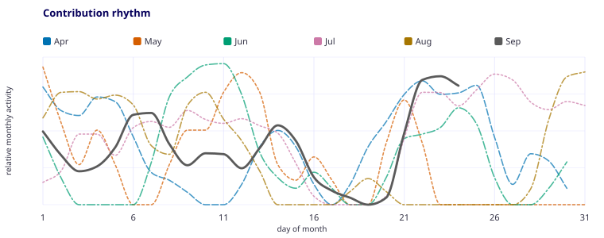

# Guilherme Afonso

**Senior Software Engineer at [Questrade](https://www.questrade.com/) · Recife, Pernambuco, Brazil**

<picture>
  <source media="(prefers-color-scheme: dark)" srcset="https://readme-typing-svg.demolab.com?font=Fira+Code&size=18&pause=1400&color=A4AAFE&center=true&vCenter=true&width=760&lines=Angular+by+trade.+React+and+React+Native+by+demand.;Interfaces%2C+APIs%2C+Figma+plugins%2C+and+the+pipelines+between+them.;New+stack%2C+familiar+problem.">
  <source media="(prefers-color-scheme: light)" srcset="https://readme-typing-svg.demolab.com?font=Fira+Code&size=18&pause=1400&color=06005B&center=true&vCenter=true&width=760&lines=Angular+by+trade.+React+and+React+Native+by+demand.;Interfaces%2C+APIs%2C+Figma+plugins%2C+and+the+pipelines+between+them.;New+stack%2C+familiar+problem.">
  
</picture>

I build trading products at Questrade and work across the full delivery path: interfaces, APIs, developer tooling, and CI. Angular and TypeScript are my strongest tools. I also ship with React, React Native, Node.js, and whatever else the problem needs.

## Featured projects

| Project | What it is |
| --- | --- |
| **[MarquinhosBOT](https://github.com/Devaneios/MarquinhosBOT)** | A Bun monorepo containing a Sapphire Discord bot, Express API, and React Discord Activity. |
| **[guilhermeasper.dev.br](https://github.com/Guilhermeasper/guilhermeasper.dev.br)** | The React portfolio and visual reference for this profile. |
| **[Assiste Comigo](https://github.com/Guilhermeasper/assiste-comigo-web-extension)** | A Chrome and Edge extension that synchronizes playback across supported streaming sites. |

## Core stack

## Contributions

<picture>
  <source media="(prefers-color-scheme: dark)" srcset="assets/activity-dark.svg">
  <source media="(prefers-color-scheme: light)" srcset="assets/activity-light.svg">
  
</picture>
